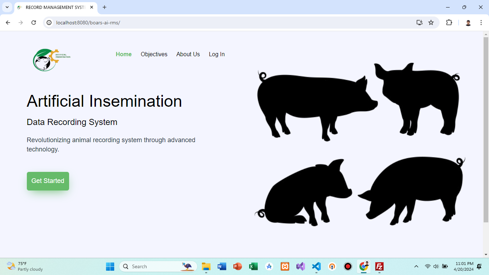
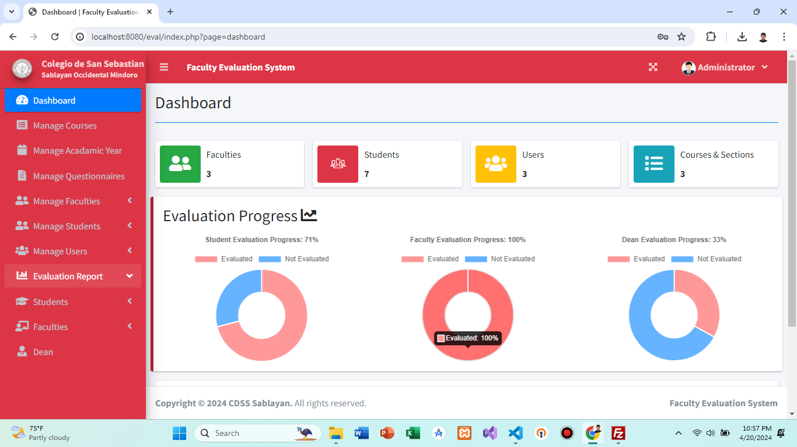
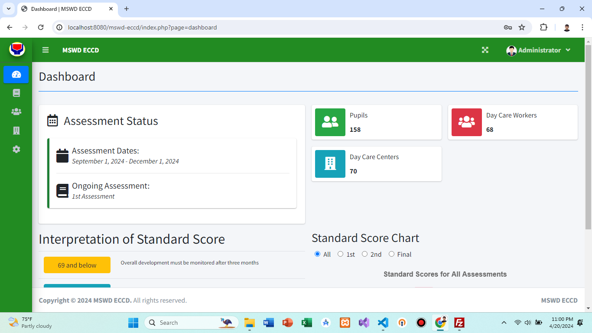
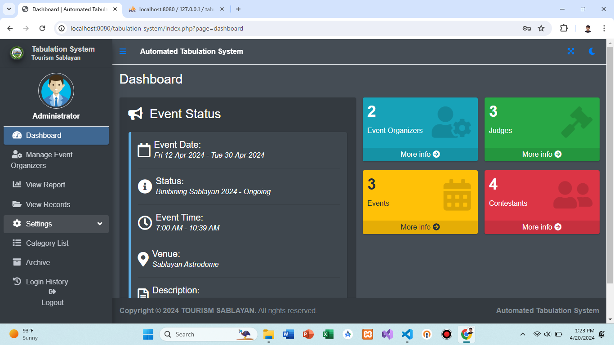
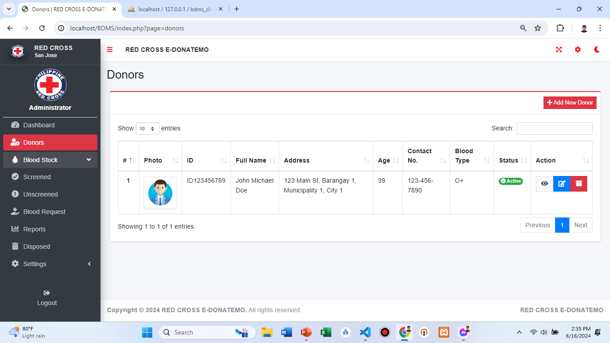

<h1 align="center"><b>Hi , I'm Romel P. Brosas </b></h1>

  

 

 
  Visitors count 
  

	
## <picture></picture> **About me**

 

- A passionate self-taught programmer
- Currently learning web and app development by myself
- Personal website [Portfolio](https://romel-laravel-portfolio.online/)
- I’m currently open for an Intern or a new job opportunity, this is [my resume](https://resume.io/r/f51rFc32k)
  

  
## <b> My Freelance Projects</b>
 

<h3>Screenshots of my freelance projects from 2020 - present</h3>

## Screenshots

  
  
  

## Description

These websites are built with HTML/CSS/JS for front-end and PHP&MySQL for backend.

## Tools Used
1. Visual Studio Code (IDE)
2. XAMPP (PHP 8)

  

  
## <b> Skills</b>
 

- **Languages**:
    
    
    

  

- **Frameworks**:
    
    

 
    
- **Front-End Development**:

   
   
   
   
   

    
    
- **Back-End Development**:

   

 

- **Cloud Hosting**:

    
    
 

- **Softwares and Tools**:

    
    
    
    
     

 
 

-----

 

## <b> Github Stats </b>
 

 
 
 

-----

 
 

## <b> Let's Connect..!</b>
 

<ul>

<li>

</li>

 

<li>

</li>

 

<li>

</li>
	
</ul>

 

 
 
 

## <b>Have a nice day and God Bless...✨</b>

 
 
 
 
